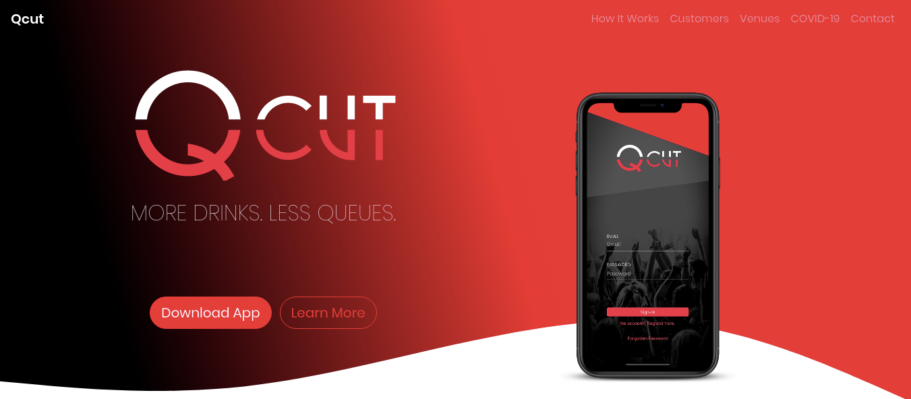

# Qcut Landing Page

> A landing page for Qcut. Built on Bootstrap along with scroll reveal animations with AOS. Demo: https://qcut.netlify.app



# Install

You require `node` and `npm` installed to bundle or develop the website. To clone the repository and install the NPM modules, run:

```bash
# clone git repository
git clone https://github.com/skdcodes/freelancer-web-Bootstrap_jQuery_AOS-Qcut_Landing_Page.git qcut

# change to project directory
cd qcut

# install npm modules
npm install
```

# Usage

To develop the website locally run:

```bash
npm run develop
```

This starts a parcel live server at [localhost:1234](http://localhost:1234) with hot reload.

# Build

To build the website run:

```bash
npm run build
```

The entire webpage along with all the static assets will be created at `dist/` folder. You can simply dump this folder onto your webserver which will serve the `index.html` page.

# Deploy

To deploy the website to Github Pages run:

```bash
npm run deploy
```

# Features

- CSS Framework - [Bootstrap](https://getbootstrap.com/)
- Bundler - [Parcel](https://parceljs.org/)
- Animations - [Animate on Scroll](http://michalsnik.github.io/aos/)

# Future

1. Make sure the "Venues" contents wrap.
2. Try to wrap each fullheight column's content for low view heights.
